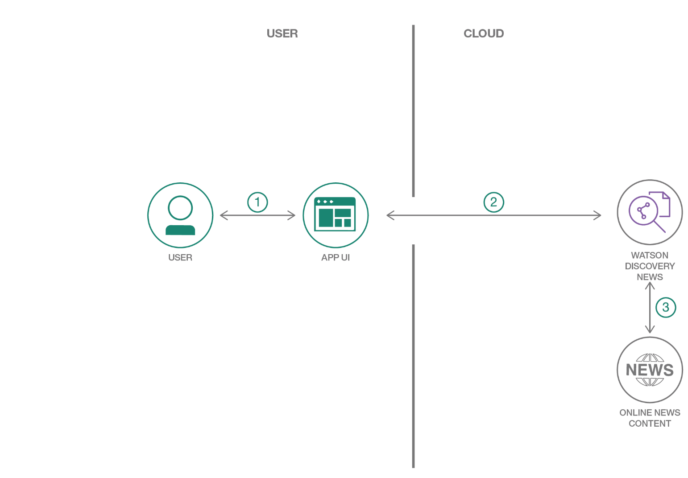
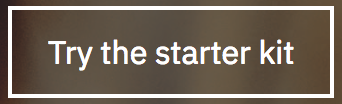
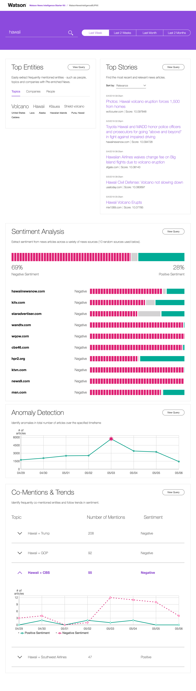

# Watson News Intelligence

The Watson News Intelligence Code Pattern for Node.js visualizes the results of [Discovery](https://www.ibm.com/watson/services/discovery) queries. The app searches [Discovery News](https://www.ibm.com/watson/services/discovery-news) data to get insights from the news, including related concepts, entities, and sentiment trends.

When the reader has completed this Code Pattern, they will understand how to:

* Build a web app with Node.js and Express
* Query Watson Discovery to gain insights
* Create a graphical user interface with React



## Flow
1. The Watson Discovery Service is continually crawling the web to update its Discovery News collection.
2. The user interacts with the app UI to request relevant news content.
3. The app sends user requests to Watson Discovery News.

## Included components
* [Watson Discovery](https://www.ibm.com/watson/developercloud/discovery.html): A cognitive search and content analytics engine for applications to identify patterns, trends, and actionable insights.

## Featured technologies
* [Node.js](https://nodejs.org/en/) - An asynchronous event driven JavaScript runtime, designed to build scalable applications
* [React](https://facebook.github.io/react/) - Javascript library for building User Interfaces
* [Express](https://expressjs.com) - A popular and minimalistic web framework for creating API and Web server

# Steps

This Code Pattern is based on a Starter Kit. You can use this repo stand-alone by following the [run locally](#run-locally) instructions below, or use the `Try the starter kit` button to take advantage of additional deployment options.

## Try the Starter Kit

[](https://console.bluemix.net/developer/watson/create-app?languages=node&services=discovery&starterKit=51d65dc8-1125-3cea-845d-5161aa6105f4)

1. Press the above `Try the starter kit` button.

1. Review/edit the details on the `Create app` page and then click on `Create`.

1. Optionally, click on `Download code` to download the Starter Kit code. This will give you a zip file of generated code giving you additional options to run locally, including:
   * Running locally with Docker
   * Running locally and deploying to the IBM Cloud as a Cloud Foundry application

1. Click on the `Deploy to Cloud` button to deploy directly to the IBM Cloud with the following options:
   * Provision the app to a Kubernetes cluster
   * Deploy the app as a Cloud Foundry app

If using these Starter Kit options, follow the instructions in the UI and/or the download.

## Run locally
> NOTE: These steps are only needed when running locally instead of using the ``Try the starter kit`` button.

1. [Clone the repo](#1-clone-the-repo)
2. [Create Watson services with IBM Cloud](#2-create-watson-services-with-ibm-cloud)
3. [Configure credentials](#3-configure-credentials)
4. [Run the application](#4-run-the-application)

### 1. Clone the repo

Clone the `watson-news-intelligence-starter-kit` locally. In a terminal, run:

```
$ git clone https://github.com/markstur/watson-news-intelligence-starter-kit
```

### 2. Create Watson services with IBM Cloud

Create the following services:

* [**Watson Discovery**](https://console.ng.bluemix.net/catalog/services/discovery)

### 3. Configure credentials

The credentials for IBM Cloud services (Discovery), can be found in the ``Services`` menu in IBM Cloud,
by selecting the ``Service Credentials`` option for the service.

Copy the Discovery credentials JSON into your local repos `server/localdev-config.json` file.

#### Example `server/localdev-config.json`:

```json
{
  "watson_discovery_url": "https://gateway.watsonplatform.net/discovery/api",
  "watson_discovery_username": "a111aaaa-1a1a-111a-a11a-1aaa1111aaa1",
  "watson_discovery_password": "aaAAA1aaaAaa"
}
```

### 4. Run the application

1. Install [Node.js](https://nodejs.org) ([LTS](https://github.com/nodejs/Release) supported versions). 

1. At the command line, go to your project directory.

1. Install the dependencies:

    ```sh
    npm install
    ```

1. Start the app:

    ```sh
    npm start
    ```

1. Point your browser to [localhost:3000](http://localhost:3000).

# Sample output

Enter a company name in the search bar to query Watson Discovery News through the app. Each panel on the page contains a visual presentation of insights derived from the API response. Press `View Query` in each panel to view the parameters of the API request and the response in JSON form.

For your first search, enter the name of a company (or some news topic) and hit enter or click on the magnifying glass icon.


After your first search, you can change the search term, and you can specify the time period for your search.


The results will include the following sections.

## Top Entitites
**Top Entities** shows a word cloud showing frequently mentioned entities for your search term. The words are sized to indicate their significance. You can click on the tabs to show entities that are topics, companies, or people.

## Top Stories
**Top Stories** shows a the top news stories that matched your search. You can sort the articles by relevance or by date.

## Sentiment Analysis
**Sentiment Analysis** shows the postitive/neutral/negative sentiment breakdown of the news articles from a variety of news sources.

## Anomaly Detection
**Anomaly Detection** shows the number of articles over the specificed time period and highlights anomalies, if any, with a red dot. You can hover over the chart to get additional details about each data point -- including an example headline.

## Co-Mentions & Trends
**Co-Mentions & Trends** shows entities that are commonly co-mentioned with your search entity and charts the trend for each entity pair. The chart tracks positive and negative sentiment for the pair over time. The total number of mentions and overall sentiment is also listed for each co-mentioned entity pair.

## Screenshot

Example results from a week with Hawaiian volcano activity:



# Links
* [Watson Node.js SDK](https://github.com/watson-developer-cloud/node-sdk): Download the Watson Node SDK.
* [Cognitive discovery architecture](https://www.ibm.com/cloud/garage/content/architecture/cognitiveDiscoveryDomain): Learn how this Code Pattern fits into the Cognitive discovery Reference Architecture.
* [Overview of the Watson Discovery service](https://www.ibm.com/watson/services/discovery/): Extract value from unstructured data by converting, normalizing, enriching it.
* [Three ways IBM has evolved Alchemy Data News into Watson Discovery News and made it even better](https://www.ibm.com/blogs/watson/2017/04/3-ways-ibm-evolved-alchemy-data-news-watson-discovery-news-made-even-better/): Watson Discovery News takes big steps forward in NLP-enriched news search.
* [IBM launches Watson Discovery Service for big data analytics at scale](https://www.techrepublic.com/article/ibm-launches-watson-discovery-service-for-big-data-analytics-at-scale/):
Suite of APIs makes it easier for companies to ingest and analyze their data, even if they don’t have advanced degrees in data science.
* [SlideShare: Building with Watson – Network Visualizations using Watson Discovery](https://www.slideshare.net/IBMWatson/building-with-watson-network-visualizations-using-watson-discovery): See an app built on the Watson Discovery Service and D3.js that helps you explore your data using a network map built on NLP metadata.


# Learn more

* **Artificial Intelligence Code Patterns**: Enjoyed this Code Pattern? Check out our other [AI Code Patterns](https://developer.ibm.com/code/technologies/artificial-intelligence/).
* **Data Analytics Code Patterns**: Enjoyed this Code Pattern? Check out our other [Data Analytics Code Patterns](https://developer.ibm.com/code/technologies/data-science/)
* **AI and Data Code Pattern Playlist**: Bookmark our [playlist](https://www.youtube.com/playlist?list=PLzUbsvIyrNfknNewObx5N7uGZ5FKH0Fde) with all of our Code Pattern videos
* **With Watson**: Want to take your Watson app to the next level? Looking to utilize Watson Brand assets? [Join the With Watson program](https://www.ibm.com/watson/with-watson/) to leverage exclusive brand, marketing, and tech resources to amplify and accelerate your Watson embedded commercial solution.
* **Kubernetes on IBM Cloud**: Deliver your apps with the combined the power of [Kubernetes and Docker on IBM Cloud](https://www.ibm.com/cloud-computing/bluemix/containers)

# License
[Apache 2.0](LICENSE)
